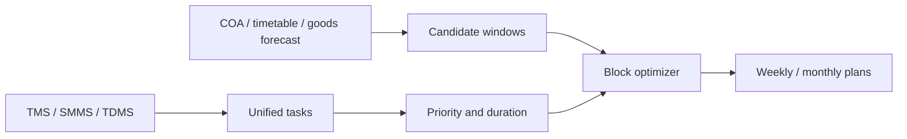

# AI Block Planning — focused Claude Code specification

Read this file completely before writing code.

Build the core solution for Smart India Hackathon problem **SIH26027 — AI-Powered Automatic Block Planning to Maximize Asset Availability for Train Operations on Indian Railways**.

## 0. Verified environment (checked against this machine)

These values were verified directly, not assumed. Where an earlier draft of this specification disagreed with the machine, the machine wins and this file was corrected.

| Item | Verified value | How it was checked |
|---|---|---|
| Node.js | 24.19.0 | `node -v` |
| npm | 11.17.0 | `npm -v` |
| `@angular/core` | 22.1.4 | `node_modules/@angular/core/package.json` |
| TypeScript | 6.0.3 | `node_modules/typescript/package.json` |
| Service decorator | `@Service()` exists in `@angular/core` 22 | `core.d.ts` declares `const Service: ServiceDecorator` |
| Signal Forms | present | `@angular/forms/signals` export map |
| `httpResource` | present | `@angular/common/types/http.d.ts` |
| `linkedSignal` | present | `@angular/core/types/core.d.ts` |
| Frontend test runner | Vitest + jsdom via `@angular/build:unit-test` | `angular.json`, `package.json` |
| MySQL server | **8.0** (`MySQL80` service, running) | `Get-Service *mysql*` |
| express / mysql2 / cors / dotenv / zod / glpk.js | 5.2.1 / 3.24.2 / 2.8.6 / 17.4.2 / 4.5.4 / 5.0.0 | `npm view <pkg> version` |

Corrections applied because of the above:

1. Angular 22 services use `@Service()`, not `@Injectable({ providedIn: 'root' })`. `@Service()` is auto-provided by default, so no `providedIn` argument is needed.
2. Angular 22 CLI file naming drops the `.service` / `.component` suffix. `ng g s services/planning-store/planning-store` produces `planning-store.ts`, not `planning-store.service.ts`. All structure listings below use the real CLI output.
3. The target database is **MySQL 8.0**, the server actually installed here. All SQL in this project stays inside the 8.0 feature set so it also runs unchanged on 8.4.
4. `frontend/src/tailwind.css` already contains a working accent + dark-mode token system that `theme-service.ts` depends on. It must be **extended**, not replaced.
5. `theme-service.ts` currently imports `../../models/theme`, but the file is at `app/modules/theme.ts`. That import is broken and must be fixed.

## 0.1 Official problem statement (verbatim)

Retrieved from the SIH 2026 problem-statement dataset (226 records, scraped 2026-08-22)
and cross-checked against the record's own metadata fields.

| Field | Value |
|---|---|
| PS number | SIH26027 |
| Title | Al-Powered Automatic Block Planning to Maximize Asset Availability for Train Operations on Indian Railways |
| Organization | Ministry of Railways |
| Department | Ministry of Railways |
| Category | Software |
| Theme | Transportation & Logistics |
| Dataset link | **(empty in the official record)** |
| Contact info | (empty) |
| Idea submission deadline | 20 September 2026 |

> **Background:** Railway maintenance for fixed infrastructure of Engineering, Traction
> Distribution, and Signal & Telecommunication departments is currently planned
> independently. Each department requests maintenance blocks/disconnections via the BDMS
> system. This planning process is decentralized and manual. This often leads to
> inefficient block utilization, poor coordination, and suboptimal scheduling, which may
> reduce asset availability and impact train operations.
>
> **Detailed Description:** Maintenance data — such as defects and overdue tasks — is
> maintained separately in systems like Track Management System (TMS), Signalling
> Maintenance & Management System (SMMS), and Traction Distribution Management System
> (TDMS). Meanwhile, the Control Office Application (COA) manages block corridor
> availability. Without integration and coordinated scheduling, maintenance
> blocks/disconnections are not optimally planned, resulting in asset downtime and reduced
> availability of fixed infrastructure for train operation. Your task is to develop an
> Automatic Block Planning system that integrates maintenance, defects and corridor data
> to generate optimized block schedules. The system should prioritize maintenance
> activities to minimize asset downtime and maximize the availability of critical
> infrastructure, ensuring uninterrupted train operations.
>
> **Expected Solution:** Participants should build an AI system that includes:
>
> 1. Integration of maintenance data (defects, overdue maintenance) from TMS, SMMS, and
>    TDMS with corridor block and block availability as per the Train Time Table and the
>    goods trains forecast from the Control Office.
> 2. Uses AI/ML algorithms to prioritize and schedule maintenance tasks based on
>    criticality, urgency, and impact on asset availability.
> 3. Optimize block scheduling to maximize asset uptime by minimizing downtime and
>    efficiently coordinating multi-department activities.
> 4. Provides block plans over multiple time horizons — weekly and monthly — to support
>    both short-term and long-term maintenance.
>
> The solution should transform current decentralized and manual block planning into a
> data-driven, coordinated process that maximizes asset availability, improves safety, and
> supports reliable train operations.

Official acronym expansions, to be used exactly:

- **TMS** — Track Management System (Engineering / track);
- **SMMS** — Signalling Maintenance & Management System (Signal & Telecommunication);
- **TDMS** — Traction Distribution Management System (Traction Distribution / OHE);
- **COA** — Control Office Application (corridor and block availability);
- **BDMS** — the existing system through which each department requests blocks and
  disconnections today. It is the *current manual process*, not one of the four expected
  deliverables, and no API contract is published, so write-back stays out of the MVP.

Because the official `dataset link` field is empty, there is no supplied production
dataset or API schema. Deterministic synthetic fixtures are therefore the intended and
only honest path, and every screen must label them as synthetic.

## 0.2 Evaluator-defensibility requirements

These come from the 10-factor problem-statement stress-test framework, reduced to the
parts that change what gets built. They are requirements, not commentary.

1. **No unearned claims.** Never present a synthetic-history model as having production
   Indian Railways accuracy, and never hard-code an optimizer improvement percentage.
   Every comparison number is computed from the same inputs at run time.
2. **Answer a live structural change.** A judge may ask for a weight, buffer, or
   constraint to be changed on the spot. Priority weights, the train safety buffer, and
   slot size therefore live in one configuration object each, not scattered through the
   solver.
3. **Survive the missing-data question.** Every adapter is swappable (`MOCK`, `JSON`,
   `REST`) so the answer to "what if the real API is unavailable?" is a code path, not a
   promise.
4. **Show the manual baseline.** The problem's own framing is decentralized vs
   coordinated planning, so the baseline planner is a deliverable, not a nicety.
5. **Be honest about the solver.** Report `OPTIMAL`, `FEASIBLE`, `FALLBACK_FEASIBLE`,
   `INFEASIBLE`, or `FAILED` as returned, and show which tasks were left unscheduled and
   why.

## 1. Build exactly what the problem asks

The official problem asks for these four outcomes:

1. Integrate maintenance defects and overdue tasks from TMS, SMMS, and TDMS with corridor/block availability, Train Time Table data, and goods-train forecasts from the Control Office.
2. Use AI/ML to prioritize and schedule work using criticality, urgency, and asset-availability impact.
3. Optimize blocks to reduce infrastructure downtime and combine compatible work from Engineering, Traction Distribution, and Signal & Telecommunication.
4. Produce weekly and monthly block plans.

The first working product must therefore implement this flow:



The final demo must answer:

- Which maintenance tasks are most urgent and why?
- Which block windows are actually feasible?
- Which tasks from different departments can share one block?
- What train movements or power requirements prevent a task from using a window?
- How is the optimized plan better than separate manual department planning?
- Which tasks remain unscheduled and why?

## 2. Do not build out-of-scope enterprise features

Do not implement these now:

- organizations, zones, divisions, users, roles, permissions, RBAC, or sessions;
- login, logout, JWT, cookies, CSRF, or password management;
- admin screens;
- approval workflow;
- audit framework;
- notifications;
- BDMS integration or write-back in the first MVP;
- Docker;
- cloud deployment or production deployment files;
- CI/CD;
- Playwright or browser E2E tests;
- SSR, prerendering, hydration, or Angular Universal;
- Redis, Kafka, queues, microservices, Python, or another database;
- Angular Material, PrimeNG, Bootstrap, or another design system;
- an ORM or query builder;
- `helmet`, `cookie-parser`, `pino`, or `pino-http`.

The system is decision support only. It must not operate railway signalling equipment, grant a real traffic block, switch traction power, or claim to replace authorized railway officials.

## 3. Required stack

### Frontend

- Angular 22 (22.1.4 installed);
- standalone components;
- client-side rendering only;
- Angular Signals for all component and shared state;
- Signal Forms where forms are required;
- Tailwind CSS 4 for all visual design.

Signal rules:

- use `signal()` for writable state;
- expose public state with `asReadonly()`;
- use `computed()` for derived state;
- use `linkedSignal()` when a selection must reset after its source options change;
- use `httpResource()` for GET/read requests where practical;
- use a small `fetch` API service for POST/PATCH commands;
- do not use NgRx, Redux, Subjects, or `BehaviorSubject` stores;
- do not use RxJS as application state;
- use `effect()` only for real side effects such as applying the selected theme.

Angular 22 service form (verified CLI output):

```ts
import { Service } from '@angular/core';

@Service()
export class PlanningStore {}
```

### Backend

- Node.js 24;
- plain JavaScript, not TypeScript;
- ES modules, not CommonJS;
- Express 5;
- MySQL 8.0 (server installed here; SQL kept 8.4-compatible);
- `mysql2/promise`;
- handwritten SQL only;
- modular/domain-based folder structure.

The backend `package.json` must contain `"type": "module"` and `"engines": { "node": "24.x" }`.

Use only `import` and `export`. Never `require` or `module.exports`.

### Minimal backend packages

`express`, `mysql2`, `cors`, `dotenv`, `zod`, `glpk.js`.

Backend scripts: `dev`, `start`, `migrate`, `seed`, `test` (`node --test`).

## 4. Focused backend structure

```text
backend/src/
├── app.js
├── server.js
├── config/env.js
├── database/
│   ├── connection.js
│   ├── migrate.js
│   ├── seed.js
│   └── migrations/
│       ├── 001_core.sql
│       ├── 002_maintenance.sql
│       ├── 003_operations.sql
│       └── 004_planning.sql
├── middleware/
│   ├── async-handler.js
│   ├── error-handler.js
│   └── not-found.js
└── modules/
    ├── sources/
    │   ├── sources.routes.js
    │   ├── sources.controller.js
    │   ├── sources.service.js
    │   ├── sources.repository.js
    │   ├── sources.validation.js
    │   └── adapters/
    │       ├── tms.adapter.js
    │       ├── smms.adapter.js
    │       ├── tdms.adapter.js
    │       ├── coa.adapter.js
    │       ├── timetable.adapter.js
    │       └── goods-forecast.adapter.js
    ├── network/
    ├── maintenance/
    ├── operations/
    └── planning/
        ├── planning.routes.js
        ├── planning.controller.js
        ├── planning.service.js
        ├── planning.repository.js
        ├── planning.validation.js
        ├── priority-engine.js
        ├── duration-engine.js
        ├── candidate-window-engine.js
        ├── baseline-planner.js
        ├── glpk-solver.js
        ├── fallback-solver.js
        ├── plan-validator.js
        └── plan-metrics.js
```

Module responsibilities:

- route: endpoint and handler wiring;
- controller: HTTP input/output only;
- validation: Zod schemas;
- service: business flow and transactions;
- repository: SQL and row mapping only;
- engine/solver: pure planning logic with no Express code.

Do not put SQL in controllers. Do not put Express request/response objects in repositories or algorithms.

## 5. Minimum MySQL schema

Use `CHAR(36)` UUID primary keys from `crypto.randomUUID()`, `DATETIME(3)` UTC timestamps, InnoDB, `utf8mb4`, foreign keys, `?` placeholders, and indexes on every filter/join/time-range field. No organization, user, role, permission, or session tables.

Tables: `source_systems`, `sync_runs`, `corridors`, `sections`, `assets`, `defects`, `maintenance_tasks`, `maintenance_history`, `train_movements`, `goods_forecasts`, `block_windows`, `planning_runs`, `plans`, `plan_blocks`, `plan_block_tasks`, `unscheduled_tasks`.

Unscheduled reason codes: `NO_BLOCK_WINDOW`, `TRAIN_CONFLICT`, `INSUFFICIENT_DURATION`, `POWER_ISOLATION_UNAVAILABLE`, `DISCONNECTION_UNAVAILABLE`, `INCOMPATIBLE_TASK`, `OUTSIDE_HORIZON`.

## 6. Source data contracts

The demo must visibly integrate all six required inputs: TMS (Engineering track), SMMS (S&T signalling), TDMS (traction distribution/OHE), COA (block windows), Train Time Table (protected passenger movements), and goods-train forecast.

All adapters must validate input, map external section/asset codes to canonical records, upsert without duplication, record accepted/rejected counts, return understandable errors, and mark fixtures as synthetic.

## 7. Required backend APIs

Prefix `/api/v1`. Health, sources, network, maintenance, operations, planning.

One consistent response format:

```json
{ "success": true, "data": {}, "message": "Planning run completed" }
```

```json
{ "success": false, "error": { "code": "VALIDATION_ERROR", "message": "...", "details": [] } }
```

## 8. AI/ML priority engine

### Level 1 — transparent fallback

Weighted sum of severity, asset criticality, overdue days, safety-critical flag, speed restriction, corridor importance, and repeat-defect count, normalised to 0–100. Weights live in one configuration object; explanation factors go to `priority_reasons_json`.

### Level 2 — real lightweight ML

Logistic regression in plain JavaScript trained on `maintenance_history`, predicting whether the task failed, escalated, or caused a restriction before maintenance. Deterministic preprocessing, one-hot categoricals, normalisation, gradient descent, time-based train/validation split, coefficients saved to JSON under the planning module. Fall back to the rule engine when history is insufficient or the model fails to load, and always report `ML` or `RULE_FALLBACK`.

### Duration engine

Historical median/P90 per task type and department; requested duration plus a safety buffer when history is insufficient. P90 drives block feasibility. Show requested, predicted, and sample count.

## 9. Candidate-window engine

Half-open `[start, end)` intervals. Subtract protected passenger movements plus a configurable safety buffer, raise impact cost with the goods forecast, and reject a task/window pair with an explicit reason code when duration, power isolation, disconnection, or section does not fit. Compatible ENG/TRD/SNT work may share a window.

Unit tests required for: no overlap, full overlap, partial overlap at start, partial overlap at end, one train splitting a window, several trains splitting a window, touching intervals.

## 10. Block optimization

`glpk.js` behind `glpk-solver.js`. Hard constraints are never relaxed to place a task. Solver status is one of `OPTIMAL`, `FEASIBLE`, `FALLBACK_FEASIBLE`, `INFEASIBLE`, `FAILED`; only a genuine GLPK optimal result may be called optimal.

Objective order: maximise scheduled critical/overdue risk, minimise block minutes, minimise train impact, maximise multi-department bundling, maximise scheduled tasks.

Greedy fallback on solver failure. `plan-validator.js` runs independently afterwards and rejects any plan with a train conflict, a task outside a block, a missing power/disconnection requirement, a duplicate assignment, or a block outside the horizon.

## 11. Baseline and impact proof

Baseline: split by department, sort by due date and severity, take the first feasible window, never bundle. Compare against optimized on scheduled tasks, critical coverage, block count, block minutes, tasks per block, multi-department blocks, train impact, and asset availability:

```text
availability % =
  ((horizon minutes × section count) - unavailable section minutes)
  / (horizon minutes × section count) × 100
```

All values calculated. Never hard-code an improvement.

## 12. Weekly and monthly planning

Weekly: seven days, 15-minute slots, detailed task and block timings. Monthly: 28–31 days, coarser slots allowed, day-wise allocation, labelled as a planning view rather than a granted operational block. Both share the same priority, candidate, validation, baseline, and metrics modules.

## 13. Focused Angular structure

Angular 22 CLI naming (no `.service` / `.component` suffix):

```text
frontend/src/app/
├── app.config.ts  app.html  app.scss  app.ts  app.routes.ts  app.spec.ts
├── components/
│   ├── layout/sidebar/       layout/topbar/
│   ├── dashboard/            data-sources/
│   ├── maintenance-tasks/    block-planner/
│   ├── plan-results/         plan-comparison/
│   └── shared/status-badge/  shared/metric-card/
│       shared/loading-state/ shared/empty-state/
├── core/
│   ├── api/api.ts
│   ├── models/{source,maintenance,operations,planning}.ts
│   └── constants/department-constants.ts
├── modules/theme.ts
└── services/
    ├── theme-service/theme-service.ts
    ├── source-store/source-store.ts
    ├── maintenance-store/maintenance-store.ts
    └── planning-store/planning-store.ts
```

Every artifact is created with the Angular CLI so the generated `.spec.ts` file is always kept. No Angular NgModules; `modules/theme.ts` is a theme model file.

### Required routes

```ts
export const routes: Routes = [
  { path: '', pathMatch: 'full', redirectTo: 'dashboard' },
  { path: 'dashboard', loadComponent: () => import('./components/dashboard/dashboard').then(m => m.Dashboard) },
  { path: 'data-sources', loadComponent: () => import('./components/data-sources/data-sources').then(m => m.DataSources) },
  { path: 'maintenance', loadComponent: () => import('./components/maintenance-tasks/maintenance-tasks').then(m => m.MaintenanceTasks) },
  { path: 'planner', loadComponent: () => import('./components/block-planner/block-planner').then(m => m.BlockPlanner) },
  { path: 'plans/:id', loadComponent: () => import('./components/plan-results/plan-results').then(m => m.PlanResults) },
  { path: 'compare', loadComponent: () => import('./components/plan-comparison/plan-comparison').then(m => m.PlanComparison) },
  { path: '**', redirectTo: 'dashboard' }
];
```

## 14. Required screens

Dashboard (source sync status, ready/critical/overdue counts, ENG/TRD/SNT split, latest weekly-plan metrics), Data Sources (six cards with sync button and counts), Maintenance Tasks (full table with filters and priority reasons), Block Planner (horizon form with staged progress), Plan Results (metrics, timeline by section, tasks per block, unscheduled reasons, plus a plain table), Plan Comparison (optimized vs baseline with numeric deltas).

## 15. Angular Signals pattern

```ts
import { computed, inject, signal, Service } from '@angular/core';

@Service()
export class PlanningStore {
  private readonly api = inject(Api);

  private readonly _plan = signal<PlanDetail | null>(null);
  private readonly _loading = signal(false);
  private readonly _error = signal<string | null>(null);

  readonly plan = this._plan.asReadonly();
  readonly loading = this._loading.asReadonly();
  readonly error = this._error.asReadonly();

  readonly hasPlan = computed(() => this._plan() !== null);
}
```

Do not store API results in plain mutable public arrays.

## 16. Tailwind-only frontend design

`frontend/src/tailwind.css` already defines a working accent-token and dark-mode system (`@custom-variant dark`, `[data-accent='...']` palettes, `@theme inline` mapping) that `theme-service.ts` drives. **Keep it.** Append the rail domain tokens:

```css
@theme {
  --color-rail-navy: #0b1f33;
  --color-rail-blue: #155e9a;
  --color-rail-teal: #0f766e;
  --color-rail-amber: #d97706;
  --color-rail-red: #b91c1c;
  --color-rail-canvas: #f4f7fb;
}
```

`angular.json` already includes `src/tailwind.css` globally.

Rules: Tailwind utilities in component HTML; `app.scss` and `styles.scss` stay empty of design CSS; no component library; inline SVG icons; native HTML tables, buttons, forms and dialogs with accessible labels; department shown by text plus colour, never colour alone; visible focus states; loading, empty, error and no-plan states.

Department colours: ENG blue, TRD amber, SNT violet, integrated block teal.

## 17. Demo seed data

Deterministic synthetic data: two corridors, 8–12 sections, 100–150 assets, 60–100 open tasks across ENG/TRD/SNT, mixed severity, overdue and future work, seven days of passenger movements, peak and low goods forecasts, 20–30 COA windows, and synthetic maintenance history.

Required demo situations: an integrated ENG+TRD+SNT block; a prioritised critical SNT task; a TDMS task rejected for missing power isolation; a passenger train splitting a window; a task too long to fit; a task left unscheduled with a clear reason; and an optimized plan measurably better than the baseline.

Display: **Synthetic demonstration data — not Indian Railways production data.**

## 18. Tests

No Playwright.

Backend uses Node's built-in test runner (`node --test`): adapter validation and idempotency, priority fallback, logistic regression on a known dataset, duration P90, interval subtraction, candidate rejection reasons, baseline planner, GLPK feasible case, fallback planner, plan validation, metrics, and planning API validation.

Frontend uses the project's Vitest + jsdom setup through `@angular/build:unit-test`. Every CLI-generated `.spec.ts` is kept and extended: theme service, source store, maintenance filters and computed counts, planning store states, planner form validation, plan metric rendering, unscheduled reasons, and optimized-vs-baseline deltas.

## 19. Implementation order

1. **Phase 1** — Express app/server, env, MySQL pool, `GET /api/v1/health`, Angular dev proxy, health on the dashboard, migration and seed runners.
2. **Phase 2** — tables, corridor/section seed, six mock adapters, unified task table.
3. **Phase 3** — rule fallback, logistic regression, duration P90, explainable scores.
4. **Phase 4** — candidate windows, GLPK solver, fallback, validation, saved plans.
5. **Phase 5** — planner form, results, timeline, comparison, monthly horizon.
6. **Phase 6** — unit tests, deterministic seed check, clean install, README.

Do not begin a later phase while the current exit condition is broken.

## 20. Local run instructions

```bash
cd backend && npm install && npm run migrate && npm run seed && npm run dev
cd frontend && npm install && npm start
```

Angular `http://localhost:4200`, Express `http://localhost:3000`, health `http://localhost:3000/api/v1/health`.

`backend/.env.example`:

```dotenv
PORT=3000
FRONTEND_ORIGIN=http://localhost:4200
MYSQL_HOST=127.0.0.1
MYSQL_PORT=3306
MYSQL_DATABASE=ai_block_planning
MYSQL_USER=root
MYSQL_PASSWORD=
DEMO_SEED=26027
PLANNING_SLOT_MINUTES=15
TRAIN_BUFFER_MINUTES=10
SOLVER_TIME_LIMIT_SECONDS=30
```

Validate required environment values at startup.

## 21. Definition of done

- [ ] Backend is JavaScript ES modules on Node.js 24, domain-module based, no CommonJS.
- [ ] Express and MySQL work without an ORM.
- [ ] Angular 22, standalone, Signals-based, CSR only, `@Service()` for services.
- [ ] Tailwind is the only design system and the existing accent tokens still work.
- [ ] No Docker, deployment, Playwright, auth, RBAC, approval, or audit code.
- [ ] All six demo inputs work; tasks are unified and deduplicated.
- [ ] Priority has a real ML path plus an explainable fallback.
- [ ] Duration estimates use P90 or a documented fallback.
- [ ] Protected trains, power, and signalling requirements are enforced.
- [ ] Multi-department tasks can share one block.
- [ ] Independent validation catches unsafe output.
- [ ] Weekly and monthly plans work from the same inputs as the baseline.
- [ ] Unscheduled tasks have reasons; synthetic data is labelled.
- [ ] Backend and Angular tests pass.

## 22. Claude Code working rules

1. Inspect existing files before editing and preserve useful code.
2. Follow the folder structure above.
3. Keep the backend in JavaScript; no TypeScript there.
4. Keep `"type": "module"` and ES imports/exports.
5. Do not add out-of-scope enterprise infrastructure.
6. Implement one working phase at a time and run the relevant tests.
7. Keep SQL in repositories with `?` placeholders.
8. Create every Angular artifact with `ng generate` and keep the generated spec file.
9. Never fabricate live railway APIs or claim demo data is official.
10. Never relax a train, power, signalling, time, or section constraint to produce a plan.
11. Do not hard-code plan metrics or optimizer improvements.
12. Keep `frontend/README.md` current.
13. Do not commit, push, or deploy unless separately requested.

## 23. References

- SIH 2026 problem statements, SIH26027: https://www.sih.gov.in/sih2026PS
- CRIS Track Management System: https://cris.org.in/loadpage?page=proTMS
- CRIS Traction Distribution Management System: https://cris.org.in/loadpage?page=proTDMS
- CRIS Control Office Application: https://cris.org.in/loadpage?page=proCOA
- Indian Railways power-block rules: https://indianrailways.gov.in/railwayboard/uploads/directorate/safety/SR_SR/SR_SR_CHAP17.PDF
- Angular Signals: https://angular.dev/guide/signals
- Angular `httpResource`: https://angular.dev/guide/http/http-resource
- Angular Tailwind setup: https://angular.dev/guide/tailwind
- Node.js releases: https://nodejs.org/en/about/previous-releases
- Express 5: https://expressjs.com/en/5x/api.html
- MySQL 8.0 manual: https://dev.mysql.com/doc/refman/8.0/en/
- MySQL2 prepared statements: https://sidorares.github.io/node-mysql2/docs
- GLPK.js: https://github.com/jvail/glpk.js/

Notes:

- TMS means Track Management System in this problem.
- BDMS write-back is deliberately deferred; no official API contract is supplied.
- No public official production dataset or API schema is supplied on the SIH page.
- `glpk.js` is GPL-3.0; review before any closed-source production use.
